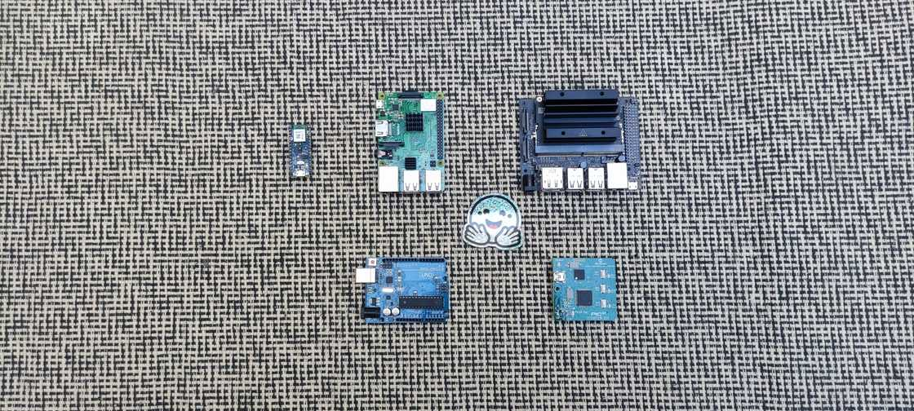
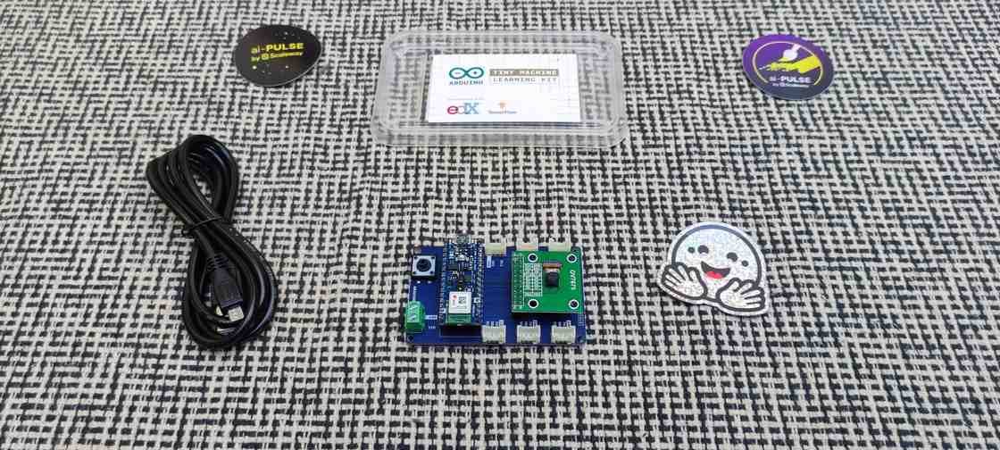
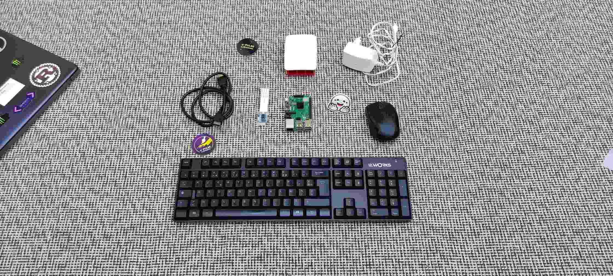
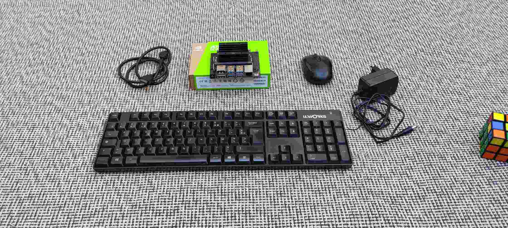
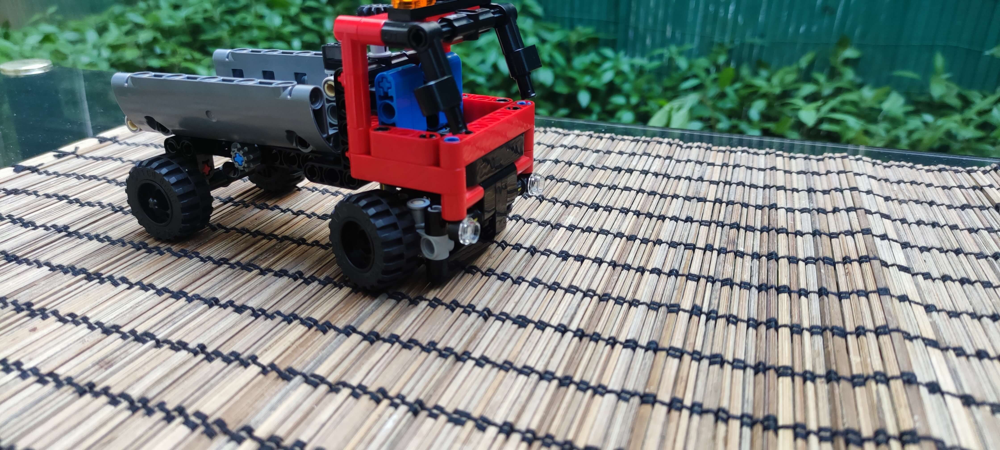

# Diesimo Lab 

[Datasets](#datasets) | [Model Garden](#models-garden) | [Platforms](#hardware-platforms) | [Benchmarks](#benchmarks) |

Welcome to the Open Edge AI Lab.

## Datasets

- Real-world custom-datasets: [HF Collections (Coming Soon)](https://huggingface.co/diesimo-ai/datasets)

## Models Garden

- Model Garden: [Hugging Face Collections (Coming soon!)](http://huggingface.co/diesimo-ai/models)
- Demos: [Hugging Face Spaces (Coming soon!)](#)

In the meantime, find the best model suitable for your application requirements here: [Edge AI Model Zoos](https://github.com/afondiel/Edge-AI-Model-Zoo).

## Hardware Platforms

### (Ultra) Low Performance

| **Device**                  | Arduino Nano 33 BLE Sense          |
|-----------------------------|------------------------------------|
| **Processor**                     | 1-Core @64MHz nRF52840, ARM Cortex-M4 32-bit (FPU)|
| **Accelerator**                     | None                              |
| **Memory**                  | 256KB RAM                         |
| **Storage**                 | 1MB Flash                         |
| **Power Consumption**       | Ultra-low power (mW)              |
| **Connectivity**            | BLE, NFC                          |
| **Camera/Display Support**  | None                              |
| **Sensors**                 | 9-axis IMU, temp, humidity, pressure, microphone, gesture, light |
| **I/O Pins**                | 14 digital, 8 analog, 12 PWM      |
| **Dimensions**              | 45mm x 18mm                       |
| **Use Case**                | TinyML, IoT, wearables            |

Full specs: ([Source](https://docs.arduino.cc/hardware/nano-33-ble-sense/)) 

### Lightweight (Entry/Medium) Performance

| **Device**                  | Raspberry Pi                            |
|-----------------------------|-----------------------------------------|
| **Processor**                     | 4-Core @1.4GHz BCM2837B0, Cortex-A53 64-bit SoC |
| **Accelerator**                     | None                              |
| **Memory**                  | 1GB LPDDR2 SDRAM                           |
| **Storage**                 | SD card                           |
| **Power Consumption**       | 4W (5V, 2.5A ≈ 12.5W, varies by load) |
| **Connectivity**            | WiFi, BLE, Ethernet, USB          |
| **Camera/Display Support**  | 8MP (up to 3840 x 2160)           |
| **Sensors**                 | None                              |
| **I/O Pins**                | Extended 40-pin GPIO header                     |
| **Dimensions**              | Not specified                     |
| **Use Case**                | Lightweight IoT, smart home, education |

Full specs: ([Source](https://www.raspberrypi.com/products/raspberry-pi-3-model-b-plus/#Specification)) 

### High Performance Computing/Applications

| **Device**                  | NVIDIA Jetson Nano                |
|-----------------------------|------------------------------------|
| **Processor**                     | 4-Core ARM Cortex A57 MPCore          |
| **Accelerator**                     | 128-core Maxwell GPU (472 GFLOPS) |
| **Memory**                  | 4GB 64-bit LPDDR4 RAM                    |
| **Storage**                 | MicroSD card (16GB UHS-1 minimum) |
| **Power Consumption**       | 20W (5V, 4A ≈ 3870 mW)            |
| **Connectivity**            | None specified (Ethernet, USB supported) |
| **Camera/Display Support**  | 8MP (up to 3840 x 2160), Full HD 1080p+ |
| **Sensors**                 | None                              |
| **I/O Pins**                | Not specified                     |
| **Dimensions**              | Not specified                     |
| **Use Case**                | AI applications, neural networks, image processing |

Full specs: ([Source](https://developer.nvidia.com/embedded/jetson-nano)) 

## Embodied Agents

For real-world data collection and testing. 

### Unmanned Ground Vehicles (UGVs)

(Lego sets) Robotics Platforms 

### Unmanned Aerial Vehicles (UAVs)

Drone

## Benchmarks

Collection of hardware-aware benchmarks including custom and industry-aware benchmarks such as [MLPerf](https://mlcommons.org/benchmarks/) built, and tested on real-world [platforms](../platforms/) for real-world performances.

- Please visit the full bench [here](./benchmarks/) (more available soon).

## Resources

- [Edge AI Engineering (Main)](https://github.com/afondiel/edge-ai-engineering)
- [Edge AI Technical Guide](https://github.com/afondiel/computer-science-notebook/tree/master/core/systems/edge-computing/edge-ai/concepts)
- [Edge AI End-to-End Stack](https://www.qualcomm.com/developer/artificial-intelligence)
- [Edge AI Deployment Stack](https://github.com/afondiel/computer-science-notebook/tree/master/core/systems/edge-computing/edge-ai/concepts/deployment)
- [Edge AI Optimization Stack](https://github.com/afondiel/computer-science-notebook/tree/master/core/systems/edge-computing/edge-ai/concepts/optimization)
- [Edge AI Frameworks](https://github.com/afondiel/computer-science-notebook/tree/master/core/systems/edge-computing/edge-ai/concepts/frameworks)
- [Edge AI Platforms](https://github.com/afondiel/Edge-AI-Platforms)
- [Edge AI Model Zoos](https://github.com/afondiel/Edge-AI-Model-Zoo)
- [Edge AI Benchmarking](https://github.com/afondiel/Edge-AI-Benchmarking)
